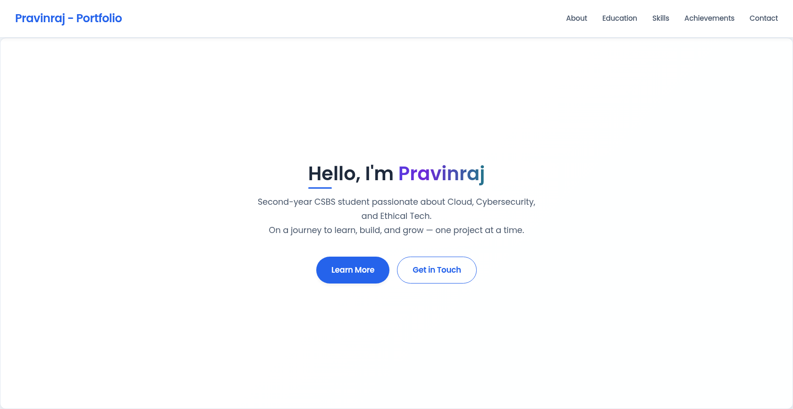

# 🌐 Pravinraj P – Portfolio

Hi! I'm **Pravinraj P**, a second-year Computer Science and Business Systems (CSBS) student at **Rajalakshmi Engineering College**, Chennai.  
This is my **personal portfolio website**, built to showcase my journey in **Cloud**, **Cybersecurity**, and **AI-driven ethical tech**.

---

## 🔗 Live Website

🌍 [pravinraj213.netlify.app](https://pravinraj213.netlify.app)

---

## 📌 Highlights

- ✅ About Me
- ✅ Education & Skills
- ✅ Project Showcase
- ✅ Contact & Resume access
- ✅ Clean, responsive UI with custom 404 page and OG image

---

## 🛠 Built With

- **HTML**
- **CSS**
- **JavaScript**

> No frameworks, just clean and simple code — handcrafted for performance and clarity.

---

## 📷 Social Preview



---

## 🚀 Setup & Run Locally

```bash
git clone https://github.com/pravinraj213/pravinraj213.github.io.git
cd pravinraj213.github.io
# Open index.html in any browser
